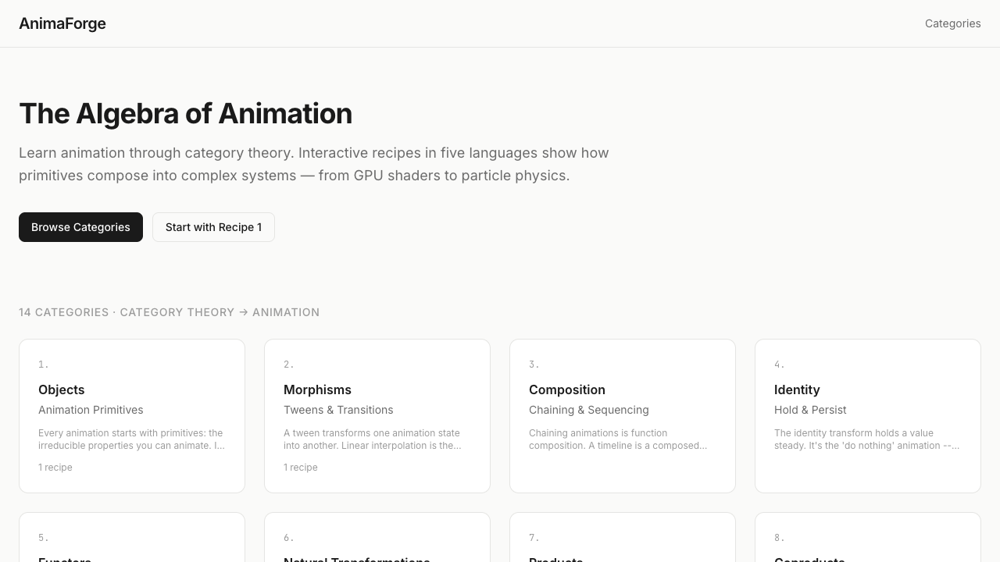

# Ruby Bagel Shop (Rails + Stimulus)

[](https://github.com/stussysenik/ruby-playground-a-bagel-shop/actions/workflows/ci.yml)
[](https://www.ruby-lang.org/)
[](https://rubyonrails.org/)
[](https://tailwindcss.com/)
[](https://stimulus.hotwired.dev/)

A premium single-page Rails experience for a fictional high-end bagel brand, built with Stimulus controllers, CSS-driven visual design, and Convex-ready live data integration points.

## Status

- Latest local commit: `d318073`
- Runtime health: `bin/rails zeitwerk:check` passes
- Test status: `bin/rails test` passes (currently no assertions authored yet)
- Delivery tracking: see [progress.md](./progress.md)

## Quick Start

```bash
bundle install
npm install
bin/rails db:prepare
bin/dev
```

If you only need Rails server:

```bash
bin/rails server
```

## Documentation

- Docs hub: [docs/README.md](./docs/README.md)
- Progress log: [progress.md](./progress.md)
- CI workflow: [.github/workflows/ci.yml](./.github/workflows/ci.yml)

## Screenshot Preview



More screenshots are organized in [docs/README.md](./docs/README.md#screenshots).
