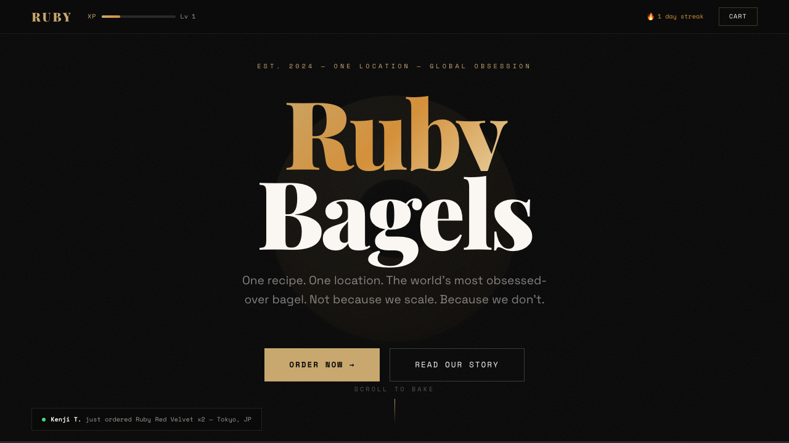
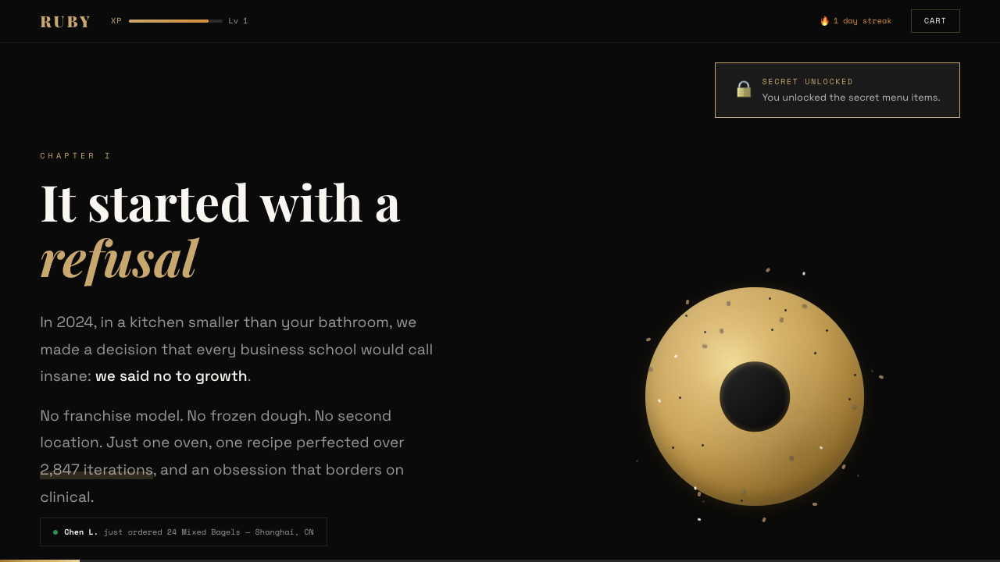
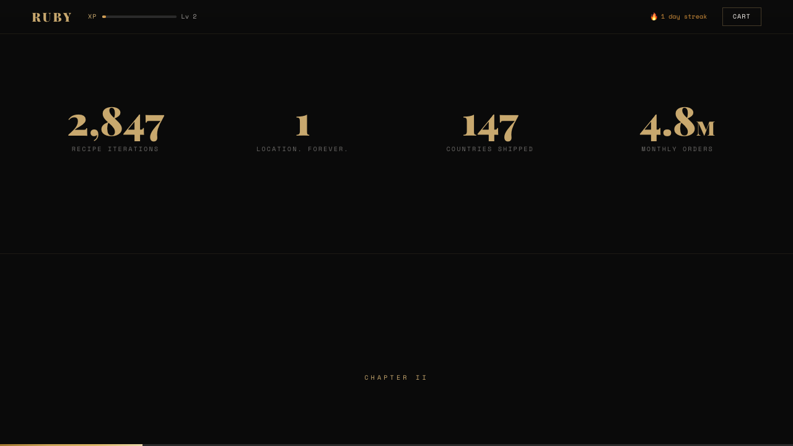
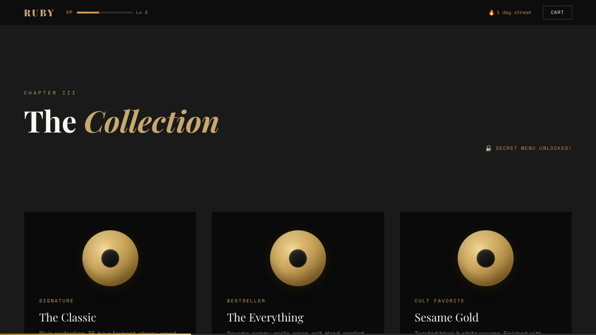
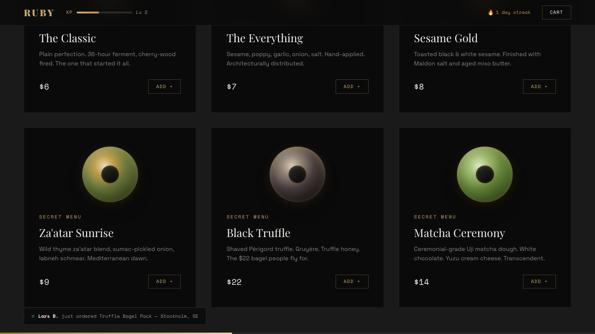
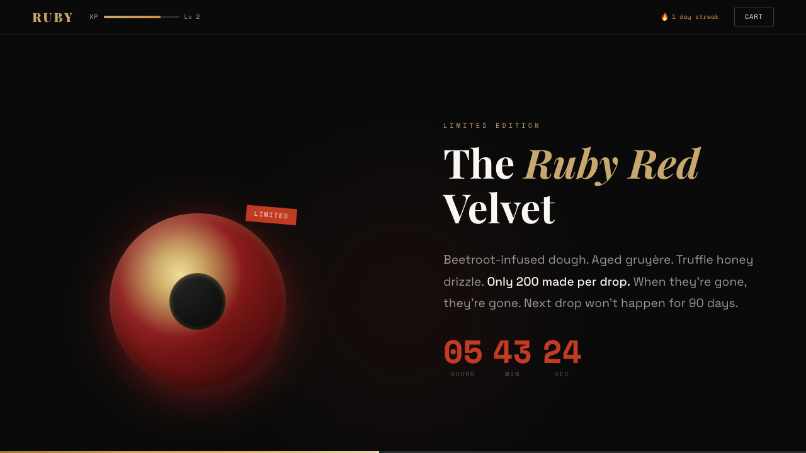
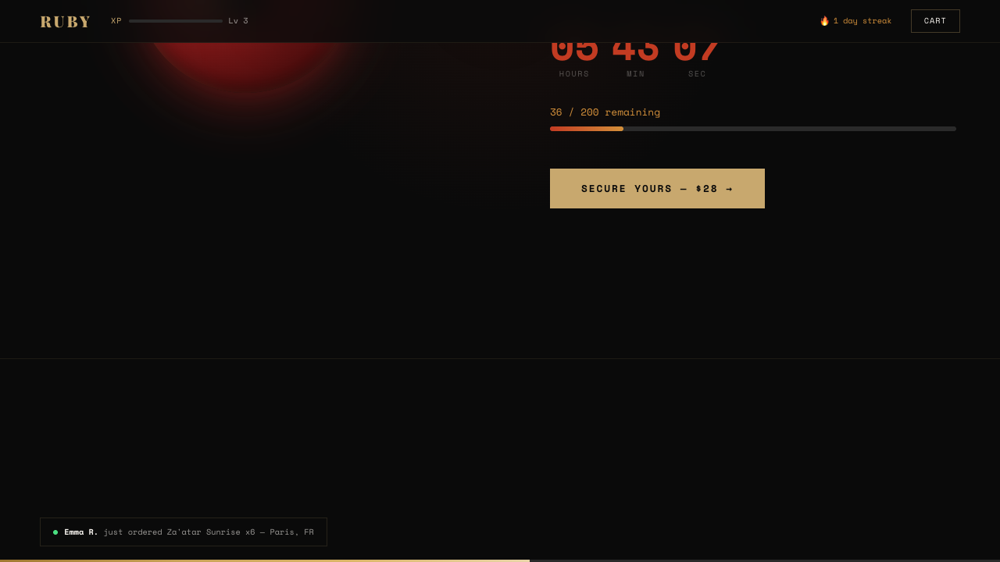
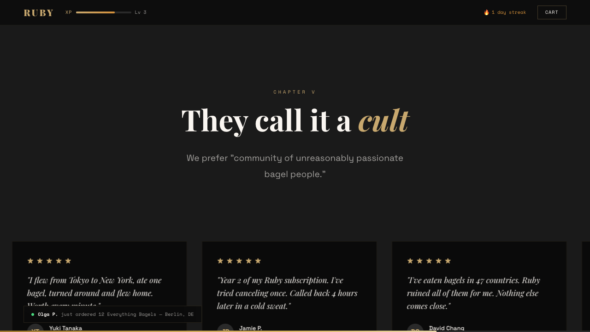
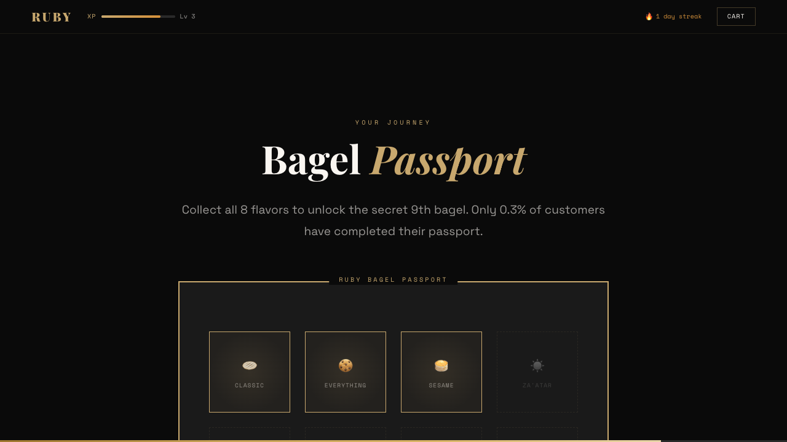
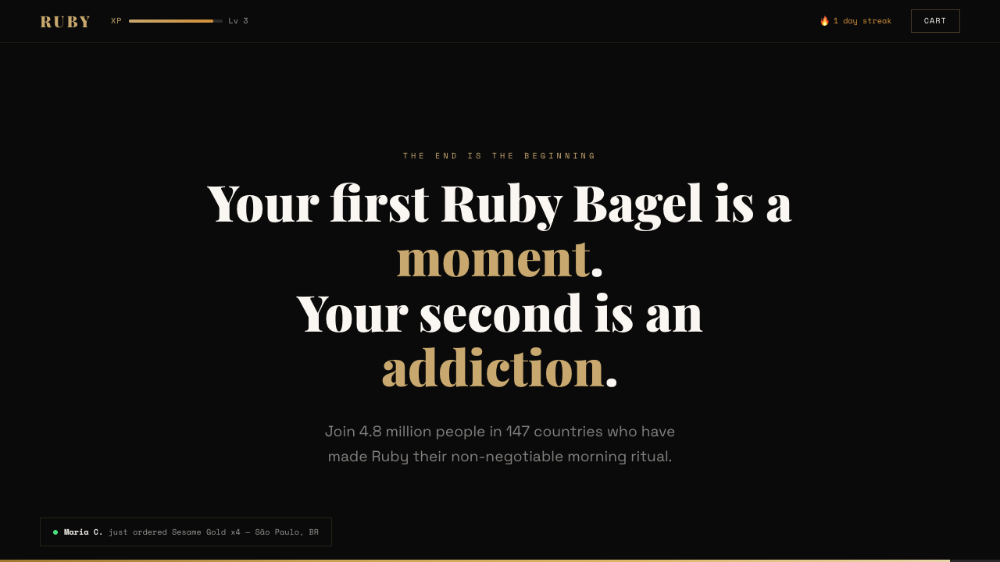

# Documentation

## Overview

Ruby Bagel Shop is a Rails 8.1 app with a cinematic, section-driven landing page.
The front-end interaction model is Stimulus-first and progressively enhanced.

## Architecture Snapshot

- `app/views/pages/landing.html.erb`: section composition and render order.
- `app/views/shared/*`: isolated section partials (hero, origin, menu, drop, global, testimonials, passport, finale).
- `app/javascript/controllers/*`: UI behavior, animation triggers, counters, cart, and gamification logic.
- `app/assets/stylesheets/components/*`: modular visual system split by concern.
- `convex/*`: optional real-time data integration layer.

## Operational Commands

```bash
bin/rails zeitwerk:check
bin/rails test
bin/dev
```

## Screenshots

### Full Experience


### Hero



### Origin



### Numbers



### Menu



### Menu Cards Detail



### Drop



### Drop Remaining



### Testimonials



### Passport



### Finale



## Roadmap Link

See [../progress.md](../progress.md) for completed milestones and upcoming work.
